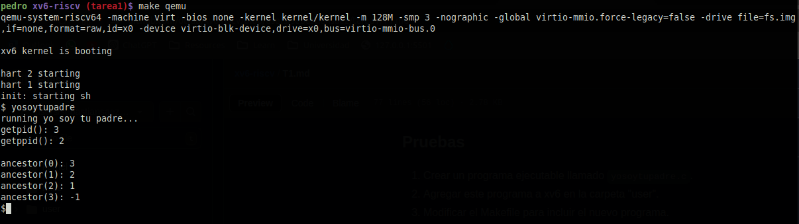

# Tarea 1

### getppid()
Para la creación de esta llamada al sistema se ha realizado una implementación idéntica a la de getpid(), con la diferencia de que se ha cambiado el valor de retorno a `task->parent->pid` en lugar de `task->pid`. Haciendo referencia al proceso padre del proceso actual.

Lo más complejo de esta implementación fue encontrar en que partes del código se deben declarar las llamadas a sistema, ya que se deben declarar tanto en el directorio `kernel` como  se deben declarar tanto en el directorio `kernel` como  se deben declarar tanto en el directorio `kernel` como en el `user`.

Esta exploración del código provocó que me encontrara con sintaxis de C que desconocía, como en el caso del archivo del archivo `kernel/syscall.c`.

### getancestor()

Para esta llamada de sistema se siguió el mismo proceso anterior, pero aquí fue más interesante la implementación en sí en el archivo `kernel/sysproc.c`. 

El código es similar al que se utilizaría para recorrer una linked list, donde hay un while loop que busca el padre `n`, donde `n` es el parámetro ingresado por el usuario, y en caso de que el proceso tenga menos de `n` ancestros, se retorna -1.
La parte de los argumentos se me hizo interesante ya que se deben utilizar otras funciones como `argint` para obtener los parámetro, y no funciona como lo haría una función común de C.

### yosoytupadre
Por último la implementación de este programa fue lo más fácil### yosoytupadre
Por último la implementación de este programa fue lo más fácil, ya que solo se debe declarar en el Makefile, y el resto funciona como C normal. Lo que fue un poxo extraño fue lograr imprimir en pantalla. Pero repliqué lo que hacían otros programas como `cat`.

