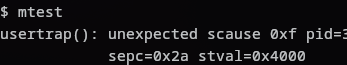

Primero creamos las llamadas de sistema `mprotect` y `munprotect`. Su respectivo código está en el archivo `kernel/sysproc.c`.

Aquí obtenemos la pagetable del proceso, y llamamos a `uvmprotect` para proteger la región específicada.

En caso de que esta función falle retornamos `-1`.

La llamada de sistema de `munprotect` es exactamente lo mismo, solo que llama a la función `uvmunprotect`.

En `kernel/defs.h` definimos las funciones `uvmprotect` y `uvmunprotect`. Las cuales interactuarán con las PTEs del proceso.

con el prefijo uvm por que son funciones que manejan pagetables del *usuario*.
En el archivo `kernel/vm.c` está su respectivo código.

En esta función, primero nos aseguramos de que la dirección sea menor que el rango permitido, sino haremos un panic en el proceso, luego calculamos la cantidad de páginas involucradas, para ello utilizamos `PGROUNDUP` para redondear hacia arriba, por ej: en caso de entregar un largo de 5670, se redondeará a 8192, que cubriría 2 páginas.

Luego lo dividiremos en el tamaño de las páginas, para obtener la cantidad de páginas involucradas, siguiendo el ejemplo sería %8192/4096%, lo que resulta en 2.

Luego iteramos sobre la cantidad de páginas, y para cada una obtenemos la dirección de su PTE, la cual nos la entrega la funcion `walk`. En caso de que la dirección sea más grande que la máxima dirección virtual permitida, walk arrojará un error.  

En caso de que exista una PTE, se realizarán la operaciónes de bits que se aprecia en la línea 18 y 20. La primera se asegurará de que el bit de escritura quedé desactivado (0), esto ser realiza mediante un una máscara de `PTE_W` y una operación `AND`.

La siguiente se asegurará de que el bit de lectura quede activado (1).

El caso de `uvmunprotect` es nuevamente exactamente lo mismo, solo que cambia la primera operación de bit, es decir, activa el bit de escritura (1).

Para los programas de prueba se crearon 3. `mtest.c`, `muntest.c` y `addrtest.c`.

`mtest` es un programa que primero protege una zona de memoria utilizando la llamada de sistema `mprotect`, y luego intenta escribir en ella. Como se aprecia en la imagen, el programa falla.

`muntest` primero desprotege una zona con `munprotect`, luego intenta escribir en ella. Luego protege la misma zona con `mprotect`, y vuelve a escribir en ella. Como se esperaría, el programa logra escribir en el primer intento, pero en el segundo falla, obteniendo el mismo resultado que mtest.

Por último, `addrtest` intenta escribir en una dirección inválida, este caso 0xFFFFFFFF, y `mprotect` falla, retornando -1.

Entre las dificultades encontradas, se podría decir que lo más complicado fue entender cómo xv6 manejaba las pagetable de cada proceso y como y donde las modificaba, fue clave entender las bit operations que realizan las funciones `uvmprotect` y `uvmunprotect` para poder entender cómo se protegían y desprotegían las páginas de memoria.
