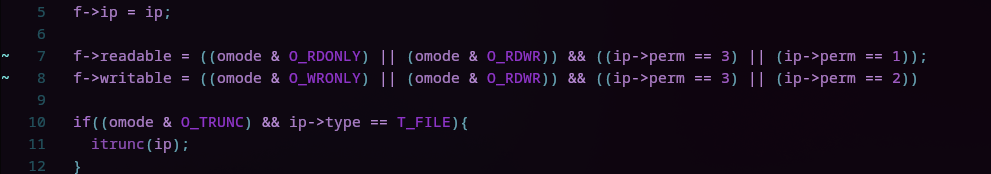
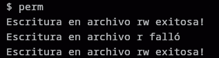

## Primera Parte

#### 1. Modificaciones


Está el `inode` y el `dinode` , sus versiones en memoria y disco respectivamente. Para agregarle los permisos a los inodos le agregamos un campo `perm` tanto al `inode` como al `dinode`.

Primero modificamos la estructura de los inodos en disco, en `kernel/fs.h`:


También en la estructura `inode` en `kernel/file.h`:


Luego agregamos el valor inicial de `perm` en cada instancia en las que se crea un inodo, cómo en la función `create` en `kernel/sysfile.c`.


Esta función es utilizada por llamadas como `sys_mkdir`, `sys_mknod` and `sys_open`.

También en la función `iupdate`, que copia un inodo en memoria a su versión en el disco.


En `ilock`, que puede leer inodos del disco.


#### 2. Operaciones

En `kernel/sysfile.c`:
Modificamos la funcion `open` para revisar los permisos, ya que aquí se utiliza un inodo para crear un archivo y se asignan los permisos según los permisos del inodo.



En `kernel/file.c`:
Modificamos también las funciones `fileread` y `filewrite`, en los cuales se verifican los permisos para tanto la lectura como lectura.

`fileread`:


`filewrite`:


#### 3. chmod
Creamos la llamada de sistema `chmod` la cual toma como argumentos el path del archivo (nombre) y el permiso que le queremos agregar como un `int`.
en `kernel/sysfile.c`:


Primero se obtiene el argumento `path`, que contiene el nombre del archivo, junto a el int `perm`, que es el permiso a modificar. 
Se realiza una verificación del permiso a modificar, y se comprueba que esté entre 0 y 3.

Luego, se utiliza la función `namei` para obtener el inodo correspondiente al archivo que tiene como nombre el valor del argumento `path`. Una vez obtenido el inodo se lockea, y se modifica el valor de su atributo `perm`, reemplazandolo por el argumento de la función. También se debe destacar que se utiliza la función `iupdate`, para que también se actualice la versión del inodo que está en el disco.

#### 4. Pruebas
Para realizar las pruebas se creó el programa de usuario `perm`:
```
#include "kernel/types.h"
#include "kernel/fcntl.h"
#include "user/user.h"

char buf[512];

int
main(int argc, char *argv[])
{
  int fd;
  char *path;

  path = "file.txt";
  fd = open(path, O_CREATE | O_RDWR);

  // escribimos en el archivo
  int n = 20;
  char buf[n];
  strcpy(buf, "texto en el archivo");

  if (write(fd, buf, n) != n) {
    fprintf(2, "write error\n");
    exit(1);
  }
  printf("Escritura en archivo rw exitosa!\n");

  int c = chmod(path, 1);
  if (c < 0) {
    printf("chmod 1 falló\n");
    exit(1);
  }

  if (write(fd, buf, n) != n) {
    printf("Escritura en archivo r falló\n");
  } else {
    printf("Escritura en archivo r exitosa!\n");
  }

  c = chmod(path, 3);
  if (c < 0) {
    printf("chmod 3 falló\n");
    exit(1);
  }
  if (write(fd, buf, n) != n) {
    printf("Escritura en archivo rw falló\n");
    exit(1);
  }
  printf("Escritura en archivo rw exitosa!\n");

  close(fd);
  exit(0);
}
```

El cual entrega el siguiente output:



Por lo que los permisos están funcionando correctamente y no es posible escribir en un archivo que solo tiene permisos de lectura.

## Segunda Parte
#### 1. Permiso especial
Para agregar el permiso inicial debemos modificar la llamada de sistema `chmod` para agregarle la posibilidad de que exista el permiso 5 y que no permita cambiar el permiso si es que es inmutable.

Así luce la nueva llamada `chmod`:


Antes de cambiar el permiso, se verifica si es que el permiso actual es 5, si lo es, se retorna un error.

Además se le agrega la siguiente condición a la función `filewrite` ya que si es inmutable no se puede escribir en el archivo.

Y también se agrega la condición en `fileread`, para que el archivo pueda ser leído.
```
if (!(f->ip->perm == 1 || f->ip->perm == 3 || f->ip->perm == 5)){
	return -1;
}
```

También se modifica la llamada de sistema `open`, para que cuando se abra un archivo, sea leíble si es que tiene permiso 5:
```
f->readable = ((omode & O_RDONLY) || (omode & O_RDWR)) && ((ip->perm == 3) || (ip->perm == 1) || (ip->perm == 5));

```
#### 2. Pruebas
Después de comprobar la escritura en el archivo con permisos rw en el programa de `perm`, se agregan las siguientes líneas:
```
c = chmod(path, 5);
if (c < 0) {
	printf("chmod 5 falló\n");
	exit(1);
}
fd = open(path, O_WRONLY);
if (write(fd, buf, n) != n) {
	printf("Escritura en archivo inmutable falló\n");
}

c = chmod(path, 3);
if (c < 0) {
	printf("chmod 5->3 falló\n");
}

```

Aquí primero convertimos el archivo en inmutable, luego lo abrimos en modo `O_WRONLY`, e intentamos escribir en él (esto debería fallar, por lo que se debería mostrar el contenido del print).

Luego intentamos convertir el archivo en rw nuevamente. Esto también debería fallar ya que el archivo ya es inmutable.

El nuevo `perm` nos arroja el siguiente output:


Por lo que todo funciona como se espera.

## Complicaciones
en la estructura de dinodo hubo que agregar un padding, ya que al compilarlo se arrojaba este error:


Esto es porque el tamaño de la estructura `dinode` era de 64 bits, y el tamaño de `BSIZE` es de 1024, por lo que:
$$
1024 \% 64 = 0
$$

Pero al agregarle el campo de `perm`, el tamaño cambió a 66 bits, por lo que el módulo ya no resultaba en 0. Se solucionó agregando un padding a la estructura `dinode` de 62 bits, para que así el tamaño quedara en 128 bits y el módulo entregara 0. Esta solución no es lo óptimo ya que le estamos agregando 62 bits vacíos a cada dinodo, pero es la solución más rápida a un problema que no está relacionado en sí con la tarea.

